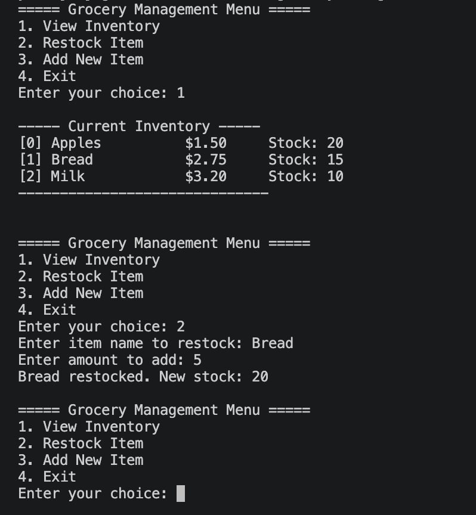
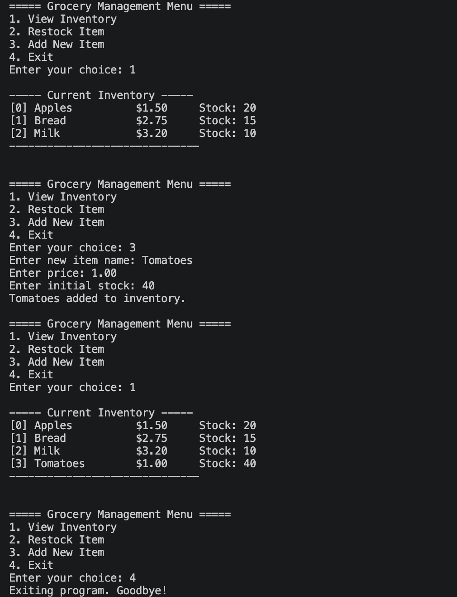
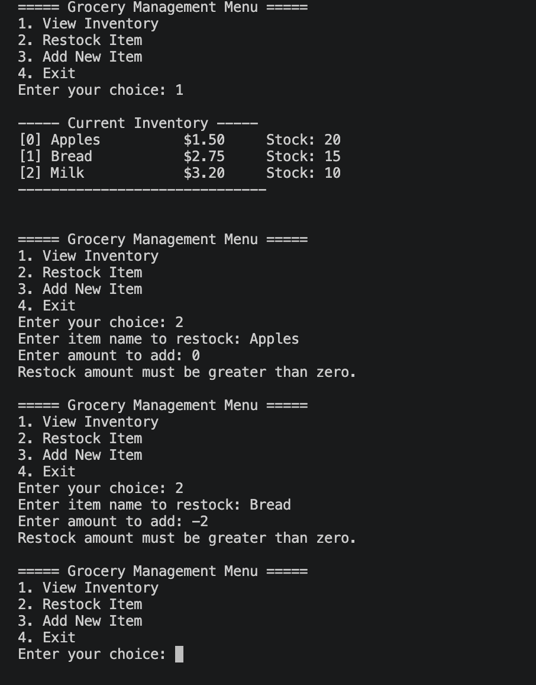
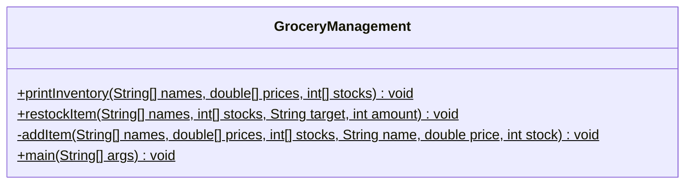

# Grocery Management System

CS3354 - Assignment 1: Java Program and Collaboration

## Project description

This Java console program manages a grocery inventory using parallel arrays. Users can view the inventory, restock existing items, add new items, and exit through a menu. The project provides practice with arrays, methods, loops, conditionals, and collaboration through GitHub branches and pull requests.

## How the program works

The `main` method creates three arrays with space for 10 items:

```java
String[] itemNames = new String[10];
double[] itemPrices = new double[10];
int[] itemStocks = new int[10];
```

The same index in each array represents one item. For example, `itemNames[0]`, `itemPrices[0]`, and `itemStocks[0]` contain the name, price, and stock of the first item. A `null` name indicates an empty slot.

The initial inventory is:

| Item | Price | Stock |
| --- | ---: | ---: |
| Apples | $1.50 | 20 |
| Bread | $2.75 | 15 |
| Milk | $3.20 | 10 |

Inventory changes remain in memory only. Restarting the program restores the initial inventory.

## Menu options

| Option | Action | Behavior |
| --- | --- | --- |
| 1 | View Inventory | Calls `printInventory` to display occupied slots. |
| 2 | Restock Item | Requests an item name and quantity, then calls `restockItem`. |
| 3 | Add New Item | Requests a name, price, and starting stock, then calls `addItem`. |
| 4 | Exit | Closes the scanner and ends the program. |

### Inventory display

`printInventory` loops through the arrays and prints each existing item's index, name, price, and stock. Empty slots are skipped.

### Restocking

`restockItem` searches for the first matching item name, ignoring capitalization. For a matching item, it rejects amounts of zero or less. Otherwise, it increases that item's stock and prints the new quantity. If no item matches, it prints `Item not found.`

### Adding items

`addItem` stores the new item in the first empty slot. If all 10 slots are occupied, it prints `Inventory is full. Cannot add new item.` The menu rejects empty names, negative prices, negative starting stock, and invalid numeric input.

## Compile and run

Install a Java Development Kit (JDK) that provides `javac`, `java`, and `javadoc`. No external libraries are needed.

From the project folder, compile and run:

```bash
javac GroceryManagement.java
java GroceryManagement
```

Enter a menu number and follow the prompts. For example, choose `2`, enter `Milk`, and enter `5` to increase Milk's initial stock from 10 to 15. Choose `1` to view the updated inventory.

## Program execution screenshots

The following screenshots show the program running in the terminal.

### Menu, inventory, and successful restocking

The initial inventory shows Bread with stock 15. Restocking Bread by 5 produces the confirmation `Bread restocked. New stock: 20`.



### Adding an item and exiting

Tomatoes are added with a price of $1.00 and starting stock of 40. The updated inventory displays the new item, and option 4 exits the program.



### Restock amount validation

Restocking Apples by 0 and Bread by -2 both produces `Restock amount must be greater than zero.` This demonstrates the validation added to `restockItem`.



## Javadoc documentation

Generate documentation in the required `docs/` folder:

```bash
javadoc -private -author -d docs GroceryManagement.java
```

Open `docs/index.html` in a browser. The `-private` option includes the private `addItem` method, and `-author` includes author information. Generate and commit the `docs/` folder before submitting the assignment.

## Team roles and contributions

The table records the team's division of work, as agreed in the group chat, and the README contribution.

| Team member | Assigned part / contribution |
| --- | --- |
| Darwin W Buchheit | Function 1: `printInventory` - inventory display. |
| Yubraj Bajagain | Function 2: `restockItem` - improved the existing method by rejecting nonpositive amounts, simplifying the search with early returns, and adding Javadoc author information. Wrote the project README, including program explanations, compile/run instructions, the contribution table, and the UML class diagram. Added generated Javadoc documentation in `docs/` and organized the program execution screenshots in the README. |
| Mathew Rodriguez | Function 3: `addItem` - adding items to an empty slot. |
| Sanskar Ghimire | Created the GitHub repository; assigned array and Scanner initialization, initial inventory, and menu creation. |
| Sonia M Spitz | Switch cases 1 and 2: viewing inventory and collecting restock input. |
| Manita Bista | Switch cases 3 and 4: adding items, validating input, and exiting. |

## UML class diagram



All four methods are static. `+` indicates public access, and `-` indicates private access. The inventory arrays and Scanner are local variables inside `main`, so they are not shown as class fields. The `main` method calls the other methods based on the selected menu option.

## GitHub workflow

Each team member works on their own branch, commits and pushes their changes, and opens a pull request for team review before merging into `main`. Yubraj's restock changes were developed on `feature-restock` and merged through pull request #2.

Repository: [cs3354-grocery-management](https://github.com/sanskar8848/cs3354-grocery-management)
